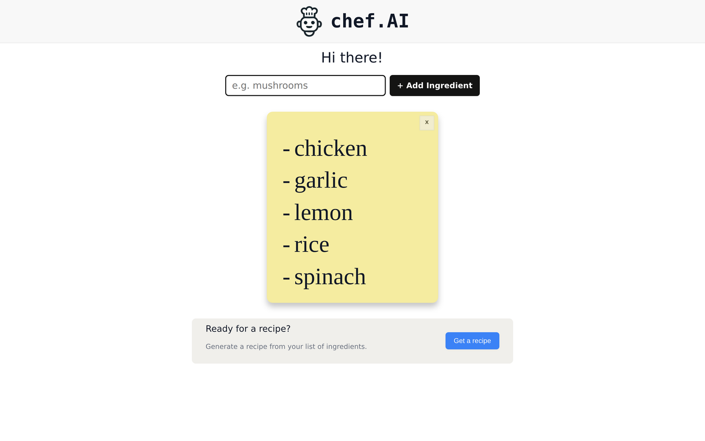

# chef.AI

Add the ingredients you have on hand, and an LLM (Anthropic's Claude) writes you a recipe —
rendered from markdown, with a typewriter-style header that walks you through the flow.



## Features

- **Ingredient list building** — add items one at a time or comma-separate several at once;
  remove the list and start over with one click.
- **AI recipe generation** — the ingredient list is sent to Claude with a system prompt that
  keeps recipes practical (uses what you have, minimal extra ingredients).
- **Markdown-rendered results** — recipes come back as markdown and render cleanly with
  `react-markdown`.
- **Responsive** — layout and typing effect tuned for mobile.

## Tech stack

React · Vite · Anthropic API · react-markdown

## Running locally

```bash
npm install
echo "VITE_API_KEY=your-anthropic-key" > .env.local
npm run dev
```

> Note: the API key is provided via a Vite env variable for local development. For a public
> deployment, the call should be moved behind a small server-side proxy (as in my
> [ai-stock-predictor](https://github.com/kquilty/ai-stock-predictor) project, which routes
> LLM calls through a Cloudflare Worker) so no credentials ship to the browser.
